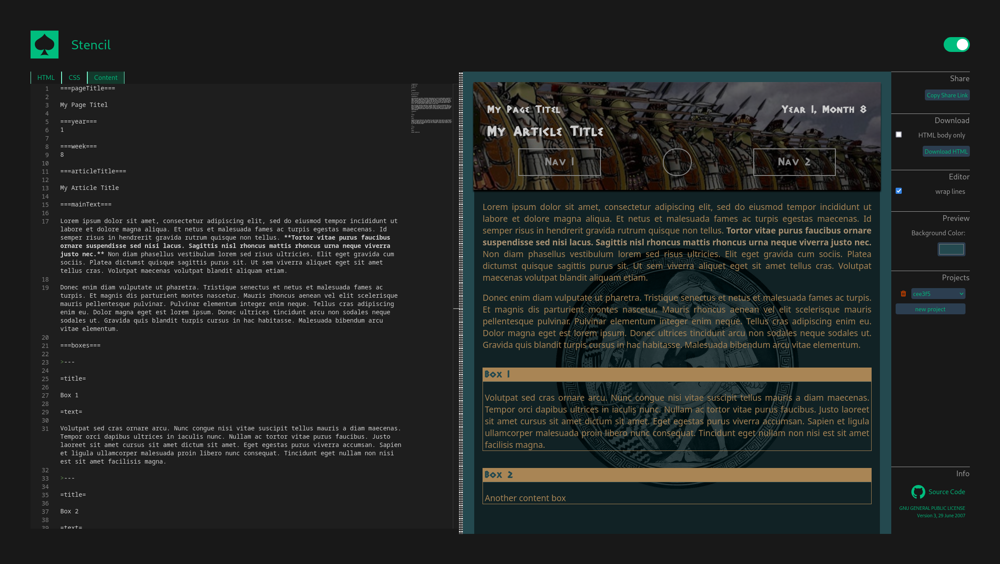

# Stencil

*A template based HTML generator. Check it out at [stencil.private-cloud.network](https://stencil.private-cloud.network).*



## Description

Stencil lets your generate web pages based on [handlebar](https://handlebarsjs.com/guide/) templates. 
CSS, HTML templates and content can be edited individually, allowing you to reuse templates and styles.
Everything happens locally in your browser.

## Development

### Project Setup

```sh
npm install
```

### Compile and Hot-Reload for Development

```sh
npm run dev
```

### Type-Check, Compile and Minify for Production

```sh
npm run build
```
